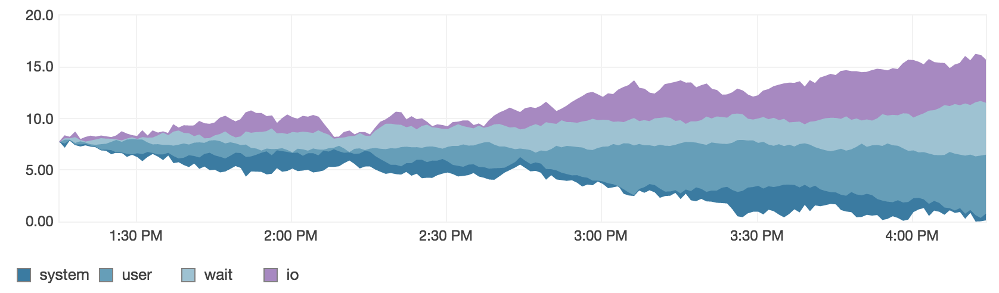

# d3 Stacking Plugin for Flot

A plugin for Flot which utilizes
[d3's stack layout](https://github.com/mbostock/d3/wiki/Stack-Layout)
to provide [stream graphs](http://www.leebyron.com/else/streamgraph/).

### Usage

There's a option to enable d3 stacking, and an `offset` parameter to control the stacking layout algorithm. Valid values are `wiggle`, `silhouette`, `expand`, and `zero`:

```javascript
series: {
    stackD3: {
        show: true,
        offset: 'wiggle'
    }
}
```

### Installation via `npm`

This package is [available on npm](https://www.npmjs.com/package/flot-d3-stack) as `flot-d3-stack`. To install from npm:

```
npm install flot-d3-stack
```

### Example



* flot-d3-stack is also in use in [Tessera](https://github.com/urbanairship/tessera).
